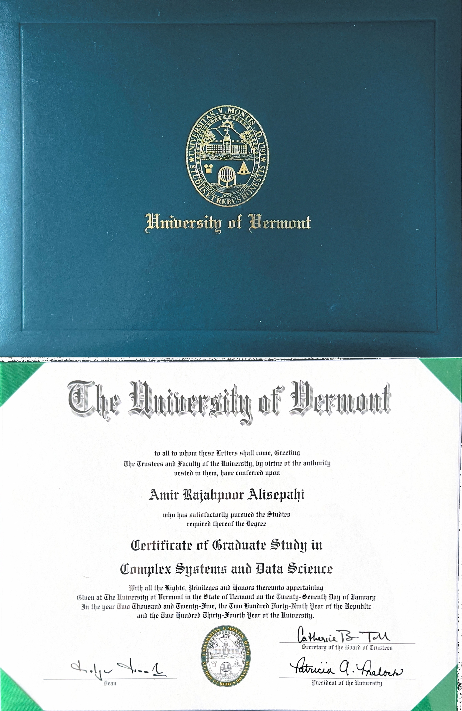
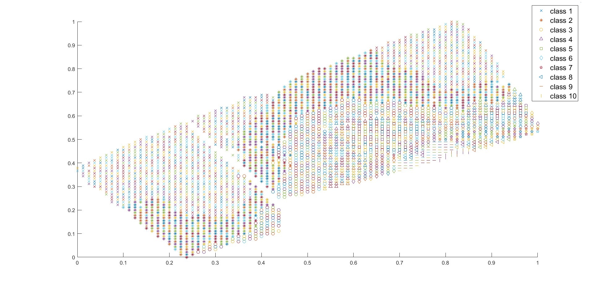
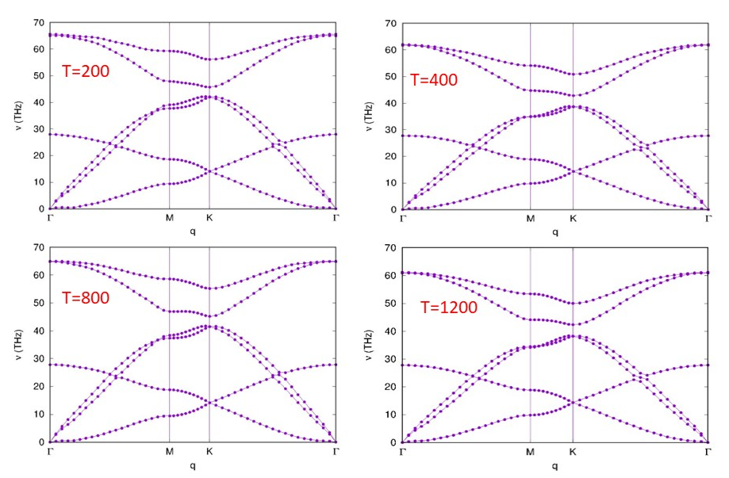

# Amir Rajabpoor Alisepahi  

## Acoustic Engineer  

#### Technical Skills:  MATLAB, Python, FEM, Phononic Crystal  

## About Me  
I am a **Ph.D. researcher in Mechanical Engineering** at the **University of Vermont**, specializing in **metamaterials, phononic crystals, and wave propagation**. My research focuses on **topological phononic band structures, mechanical wave control, and computational solid mechanics**. With expertise in **finite element modeling (FEM), vibrational analysis, and machine learning applications in engineering**, I strive to bridge the gap between theory and experimentation.  

I have extensive experience in **computational modeling, laser vibrometry, and metamaterial fabrication**. My goal is to **develop novel metamaterial structures for applications in energy harvesting, wave filtering, and noise reduction**. 

----

## Work Experience  

### **University of Vermont - Research Assistant**  
📅 *Jan 2022 – Present*  
- Conducted vibrational analysis using a laser vibrometer on metamaterials fabricated as part of research projects.  
- Designed and tested experimental mechanical metamaterials, integrating theoretical and simulation models with practical outcomes.  
- Teaching assistant in the course *Energy Methods in Solid Mechanics*.  

### **FELEZ TABAN Construction Co. - Mechanical Engineer**  
📅 *Mar 2016 – Dec 2021*  
- Managed the production line.  
- Inspected and monitored work areas, examined tools and equipment, and provided employee safety training.  
- Negotiated material prices with suppliers and coordinated inventory or cost control programs, ensuring accuracy in billing and receiving.  
- Attended meetings and discussed project details with clients and contractors.  
- Prepared isometric drawings.  

### **University of Tehran - Teaching Assistant (Workshop Tools)**  
📅 *Feb 2014 – Feb 2016*  
- Prepared teaching materials.  
- Provided students with safety instructions.  
- Assisted in solving problems in class.  
- Taught students how to work with different equipment.  
- Worked with CNC machines and simulated processes.  

---

## Education  

### **University of Vermont**  
🎓 *Ph.D. in Mechanical Engineering* (Feb 2022 – Present)  
📌 *Project:* Wave propagation in acoustic metamaterials  

### **University of Tehran**  
🎓 *M.Sc. in Mechanical Engineering* (Feb 2014 – Feb 2016)  
📌 *Project:* Vibration and Buckling Analysis of FG Nanoplates  

### **Razi University of Kermanshah**  
🎓 *B.Sc. in Mechanical Engineering* (Sep 2006 – Sep 2011)  
📌 *Project:* Effect of Low Velocity Impact in Functionally Graded Circular Plates  

---

## Research Interests  
- Metamaterials  
- Wave propagation  
- Vibrational analysis  
- Mechanical simulations  
- FEM  
- Data Science  

---

## Certifications  
- **Complex Systems and Data Science**  

  

---

## Talks & Lectures  
- **Poster Presentation** - Structural Health Monitoring, Fall 2021  
- **Topological Phononic Crystal** - Structural Health Monitoring, Fall 2021  

---

## Publications  

- **Rajabpoor Alisepahi, A.; Ma, J.** In-Gap Edge and Domain-Wall States in Largely Perturbed Phononic Su–Schrieffer–Heeger Lattices. *Crystals*, 2024, 14, 102.  
- **Rajabpoor Alisepahi, A., Sarkar, S., Sun, K. et al.** Breakdown of conventional winding number calculation in one-dimensional lattices with interactions beyond nearest neighbors. *Commun Phys* 6, 334 (2023).  
- **SM Mousavi Janbeh Sarayi, A. Rajabpoor Alisepahi, A Bahrami.** Wave analysis of thick rectangular Graphene sheets: Thickness and small-scale effects on natural and bifurcation frequencies. *Sustainability*, 2022, 14 (19), 12329.  
- **Daneshmehr, A., A. Rajabpoor, and A. Hadi.** Size-dependent free vibration analysis of Nano plates made of functionally graded materials based on nonlocal elasticity theory with high-order theories. *International Journal of Engineering Science*, 2015.  
- **Daneshmehr, A.R., M. Mohammad Abadi, and A. Rajabpoor.** Thermal effect on static bending, vibration, and buckling of Reddy beam based on modified couple stress theory. *Applied Mechanics and Materials*, 2013.  
- **Daneshmehr, A. and A. Rajabpoor.** Stability of size-dependent functionally graded Nano plates based on nonlocal elasticity and higher-order plate theories with different boundary conditions. *International Journal of Engineering Science*, 2014.  
- **Ali Zargaripoor, Alireza Daneshmehr, Seyed Imman Isaac Hosseini, Amir Rajabpoor.** Free Vibration Analysis of Nano plates Made of Functionally Graded Materials Based on Nonlocal Elasticity Theory Using Finite Element Method.  
- **Wave Analysis of Thick Rectangular Graphene Sheets: Thickness and Small-Scale Effects on Natural and Bifurcation Frequencies**. *Sustainability*, 2022.  

---
## Academic Experience  

- **Predicting Soil Parameters Using the Counter-Propagation Method**  
  Developed a machine learning model to predict soil parameters using counter-propagation neural networks.  
    

- **Predicting Car Accident Severity in Vermont**  
  Analyzed the severity of car accidents based on **environmental and ambient factors** using machine learning techniques.  

- **Spatio-Temporal Modeling of Malaria Prevalence**  
  Utilized the **R-INLA package and SPDE approach** to develop predictive models for malaria spread.  

- **Phonon Dispersion in Graphene Sheets: Impact of Temperature**  
  - Employed **multiscale simulation techniques** within the **LAMMPS molecular dynamics framework** to compute the phonon band structure of graphene.  
  - Investigated the effect of **temperature variations** on phonon dispersion using the **Tersoff potential**.  
  - Examined vibrational properties and phononic behavior at different thermal conditions.  
    

- **Quantifying Antisemitism on Twitter**  
  Explored **text classification challenges and annotation schemes** to analyze antisemitic content on Twitter using **natural language processing (NLP) techniques**.  

- **Buckling Analysis of Functionally Graded (FG) Nanoplates**  
  - Studied **buckling behavior** using the **finite element method (FEM)** based on **nonlocal elasticity theory**.  

- **Vibrational Analysis of FG Nanoplates**  
  - Investigated **nanoplate vibrations** using the **couple stress theory** and **finite element modeling**.  

- **Battery Bus Project – University of Tehran**  
  Contributed to the design and optimization of a **battery-powered bus**, focusing on **energy efficiency and structural durability**.  

- **Effect of Boundary Conditions on Composite Skew Nanoplates**  
  - Examined how different **boundary conditions** influence the **natural frequency** of composite skew nanoplates embedded in an **elastic medium** using the **Generalized Differential Quadrature (GDQ) method**.  

- **Elastic-Plastic Buckling of Circular Plates**  
  - Modeled **elastic-plastic buckling behavior** in circular plates with variable thickness, evaluating key **structural parameters** affecting stability.  

---

## Skills  

- Experienced with **Laser Vibrometer** in Complex of Metamaterials Lab  
- Experienced in **Machine Learning tools** such as TensorFlow and PyTorch  
- Proficient in **COMSOL, Ansys, SolidWorks, Abaqus**  
- Skilled in **MATLAB, Python**  
- Experienced with **Molecular Dynamics**  
- Knowledgeable in **MEMS & NEMS**  
- Proficient in **numerical methods** (FEM, GDQ methods)  
- Knowledgeable in **Mechanical Equipment Design and Functional Analysis**  
- Skilled in **Interpreting Engineering Standards, Specifications, and Drawings**  
- Familiar with **Industrial Drawing and Relevant Standards**  
- Familiar with **CNC Machines**  

---

## Projects  

### **Data-Driven EEG Band Discovery with Decision Trees**  
📄 [Publication]  

  

### **Decoding Physical and Cognitive Impacts of Particulate Matter Concentrations at Ultra-Fine Scales**  
📄 [Publication]  
