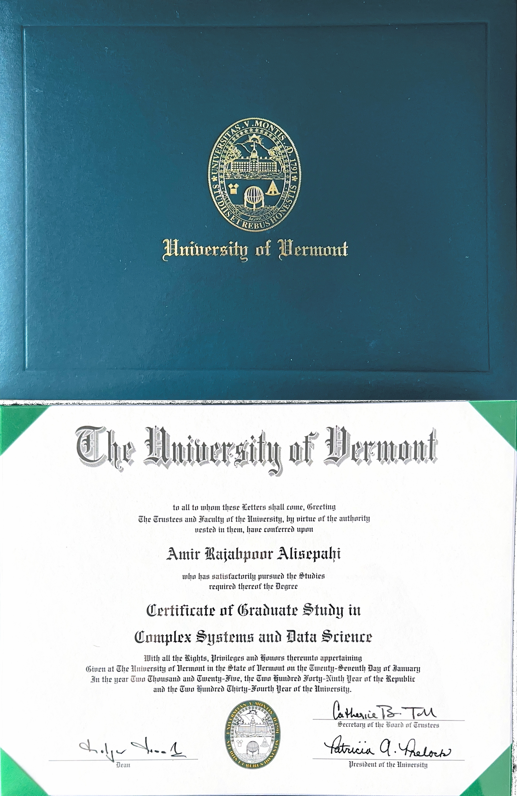

  <!-- HERO -->

  

    

      
Profile

      <h1>Amir Rajabpoor Alisepahi</h1>
      <h2>Ph.D. Researcher · Mechanical & Acoustic Metamaterials · University of Vermont</h2>

      

        Mechanical / Phononic Metamaterials
        Wave Propagation & Topological States
        FEM & Laser Vibrometry
        Complex Systems & Data Science
        NSF I-Corps Innovation
      

      

        I design and study mechanical and acoustic metamaterials that control how waves move—
        from topological edge states in phononic crystals to data-driven models of complex
        structures. My work integrates analytical modeling, finite element simulations, and
        3D-printed experiments to connect fundamental mechanics with real engineering applications.
      

      

        <a class="primary-link" href="#research">See my research</a>
        <a href="#publications">Publications</a>
        <a href="#projects">Data & projects</a>
        <a href="mailto:amir.rajabpoor@uvm.edu">Email</a>
        <!-- Add your own links here -->
        <!-- <a href="YOUR_CV_PDF_URL">CV (PDF)</a> -->
        <!-- <a href="YOUR_SCHOLAR_URL">Google Scholar</a> -->
        <!-- <a href="YOUR_LINKEDIN_URL">LinkedIn</a> -->
      

    

    

      
    

  

  <!-- TOP NAV -->

  <nav class="amir-nav">
    <a href="#about">About</a>
    <a href="#research">Metamaterials & Research</a>
    <a href="#projects">Data & Projects</a>
    <a href="#publications">Publications</a>
    <a href="#experience">Experience</a>
    <a href="#skills">Skills</a>
    <a href="#education">Education</a>
  </nav>

  <!-- ABOUT + HIGHLIGHTS -->

  <section id="about" class="amir-section">
    

      

        
About

        <h3>What I work on</h3>
        

          I am a Ph.D. candidate in Mechanical Engineering at the University of Vermont, focusing on
          <strong>mechanical and phononic metamaterials, topological phononic band structures, and wave propagation</strong>.
          I build and analyze lattices with long-range couplings, in-gap edge and domain-wall states, and
          nonlinear effects—then validate them with 3D-printed experiments and laser vibrometry.
        

        

          Alongside metamaterials, I hold a graduate certificate in
          <strong>Complex Systems and Data Science</strong>, using machine learning and statistical modeling to study
          complex physical and environmental systems. I am especially interested in translational directions such as
          <strong>semiconductor heat management, structural health monitoring, and acoustic/thermal control</strong>.
        

      

      

        
Highlights

        <h3>Snapshot</h3>
        <ul class="amir-list-tight">
          <li>First-author work in <em>Communications Physics</em> and <em>Crystals</em> on topological and long-range phononic lattices.</li>
          <li>Hands-on experimental work: 3D-printed metamaterial prototypes + laser vibrometer measurements.</li>
          <li>Certificate in Complex Systems & Data Science (UVM) with projects in ML, spatial statistics, and NLP.</li>
          <li>NSF I-Corps–funded team exploring phononic/thermal metamaterials for semiconductor heat management.</li>
        </ul>

        <figure class="amir-figure">
          
          <figcaption>Graduate Certificate in Complex Systems &amp; Data Science, University of Vermont.</figcaption>
        </figure>
      

    

  </section>

  <!-- RESEARCH: TABS -->

  <section id="research" class="amir-section">
    
Research

    <h3>Metamaterials, Wave Control & Topological Phononics</h3>

    

      

        <button class="amir-tab-button active" data-tab="meta">Mechanical / Phononic Metamaterials</button>
        <button class="amir-tab-button" data-tab="topo">Topology & Long-Range Coupling</button>
        <button class="amir-tab-button" data-tab="exp">Experiments & Figures</button>
      

      

        

          I design periodic and quasi-periodic mechanical lattices that manipulate elastic and acoustic waves across
          a wide range of frequencies. This includes:
        

        <ul class="amir-list-tight">
          <li>Phononic crystals with engineered bandgaps for vibration isolation and wave filtering.</li>
          <li>Mechanical metamaterials that guide waves along designed paths or localize energy at interfaces.</li>
          <li>Nonlinear and amplitude-dependent wave phenomena in discrete and continuum systems.</li>
        </ul>
        

          Tools: analytical derivations (e.g., dispersion relations, nonlocal models), finite element analysis
          (COMSOL, MATLAB), and reduced-order models to connect design parameters with band structures.
        

      

      

        

          A large part of my work focuses on <strong>topological phononic band structures</strong> and on how going beyond
          nearest-neighbor interactions changes the usual picture. Recent topics include:
        

        <ul class="amir-list-tight">
          <li>
            Breakdown of conventional winding-number calculations in 1D lattices with interactions beyond nearest neighbors.
          </li>
          <li>
            In-gap edge and domain-wall states in strongly perturbed Su–Schrieffer–Heeger (SSH)-type phononic lattices.
          </li>
          <li>
            Exploring how symmetry, disorder, and coupling range affect robustness of localized edge modes.
          </li>
        </ul>
        

          These studies bridge rigorous topological analysis with realistic mechanical architectures that can be
          fabricated and tested in the lab.
        

      

      

        

          I close the loop between modeling and experiment using 3D-printed structures and full-field measurements:
        

        <ul class="amir-list-tight">
          <li>Design and fabrication of mechanical lattices and metamaterial beams.</li>
          <li>Laser vibrometer measurements to map mode shapes and verify localized states.</li>
          <li>Comparison of measured dispersion with FEM and analytical predictions.</li>
        </ul>

        <figure class="amir-figure">
          
          <figcaption>
            Example dispersion analysis: temperature-dependent phonon band structures from multiscale simulations.
          </figcaption>
        </figure>
      

    

  </section>

  <!-- DATA / PROJECTS: TABS WITH FIGURES -->

  <section id="projects" class="amir-section">
    
Data & Complex Systems

    <h3>Data-Driven Engineering & Applied ML Projects</h3>

    

      Through the Complex Systems &amp; Data Science program and independent work, I apply machine learning
      and statistical modeling to engineering, environmental, and social-data problems. Below are a few examples.
    

    

      

        <button class="amir-tab-button active" data-tab="ds-ml">ML & Prediction</button>
        <button class="amir-tab-button" data-tab="ds-spatial">Spatial & Spatio-Temporal Modeling</button>
        <button class="amir-tab-button" data-tab="ds-nlp">Text & Social Data</button>
      

      

        <ul class="amir-list-tight">
          <li><strong>Predicting Soil Parameters Using Counter-Propagation Neural Networks</strong> – Built models to infer geotechnical soil properties from limited measurements.</li>
          <li><strong>Predicting Car Accident Severity in Vermont</strong> – Classified crash severity using environmental, road, and temporal features.</li>
          <li><strong>Battery-Bus Design Project</strong> – Contributed to energy-efficiency and structural considerations in an electric bus design.</li>
        </ul>

        <figure class="amir-figure">
          
          <figcaption>
            Example ML output: multi-class prediction performance for a counter-propagation neural-network model.
          </figcaption>
        </figure>
      

      

        <ul class="amir-list-tight">
          <li><strong>Spatio-Temporal Modeling of Malaria Prevalence</strong> – Used R-INLA and SPDE methods to capture spatial structure and temporal trends.</li>
          <li><strong>Impact of Boundary Conditions on Composite Skew Nanoplates</strong> – Investigated frequency shifts using GDQ and FEM frameworks.</li>
          <li><strong>Elastic-Plastic Buckling of Circular Plates with Variable Thickness</strong> – Modeled stability limits under different loading and geometry configurations.</li>
        </ul>
      

      

        <ul class="amir-list-tight">
          <li><strong>Quantifying Antisemitism on Twitter</strong> – Explored annotation schemes and NLP pipelines for hate-speech classification.</li>
        </ul>
        

          These projects sharpen my ability to combine domain knowledge in mechanics with modern data science, using
          tools such as Python, R, TensorFlow, PyTorch, and advanced Bayesian methods.
        

      

    

  </section>

  <!-- PUBLICATIONS -->

  <section id="publications" class="amir-section">
    
Selected Work

    <h3>Publications</h3>
    
Representative publications (first author unless otherwise noted):

    <ul class="amir-list-tight">
      <li>
        Rajabpoor Alisepahi, A.; Ma, J. <strong>In-Gap Edge and Domain-Wall States in Largely Perturbed Phononic Su–Schrieffer–Heeger Lattices.</strong>
        <em>Crystals</em>, 2024, 14, 102.
      </li>
      <li>
        Rajabpoor Alisepahi, A., Sarkar, S., Sun, K. et al.
        <strong>Breakdown of Conventional Winding Number Calculation in One-Dimensional Lattices with Interactions Beyond Nearest Neighbors.</strong>
        <em>Communications Physics</em> 6, 334 (2023).
      </li>
      <li>
        S.M. Mousavi Janbeh Sarayi, A. Rajabpoor Alisepahi, A. Bahrami.
        <strong>Wave Analysis of Thick Rectangular Graphene Sheets: Thickness and Small-Scale Effects on Natural and Bifurcation Frequencies.</strong>
        <em>Sustainability</em> 14(19), 12329 (2022).
      </li>
      <li>
        Daneshmehr, A., A. Rajabpoor, and A. Hadi.
        <strong>Size-Dependent Free Vibration Analysis of Nanoplates Made of Functionally Graded Materials Based on Nonlocal Elasticity Theory with High-Order Theories.</strong>
        <em>International Journal of Engineering Science</em>, 2015.
      </li>
      <li>
        Daneshmehr, A.R., M. Mohammad Abadi, and A. Rajabpoor.
        <strong>Thermal Effect on Static Bending, Vibration, and Buckling of Reddy Beam Based on Modified Couple-Stress Theory.</strong>
        <em>Applied Mechanics and Materials</em>, 2013.
      </li>
    </ul>
    

      For a complete and up-to-date list of publications, please see my Google Scholar profile.
    

  </section>

  <!-- EXPERIENCE -->

  <section id="experience" class="amir-section">
    
Experience

    <h3>Professional & Academic Experience</h3>

    <h4>University of Vermont – Research Assistant</h4>
    
<em>Jan 2022 – Present · Burlington, VT</em>

    <ul class="amir-list-tight">
      <li>Develop analytical and numerical models for mechanical and phononic metamaterials, including lattices with long-range coupling and localized edge states.</li>
      <li>Design and fabricate 3D-printed metamaterial structures; perform vibrational analysis using laser vibrometry and compare with FEM/analytical predictions.</li>
      <li>Serve as Teaching Assistant for <em>Energy Methods in Solid Mechanics</em> and mentor undergraduate researchers in modeling and experimentation.</li>
    </ul>

    <h4>FELEZ TABAN Construction Co. – Mechanical Engineer</h4>
    
<em>Mar 2016 – Dec 2021</em>

    <ul class="amir-list-tight">
      <li>Managed production-line operations, equipment monitoring, and safety training for mechanical systems.</li>
      <li>Coordinated with suppliers and contractors on material specifications, pricing, and inventory / cost-control programs.</li>
      <li>Prepared isometric drawings and assisted in mechanical design, troubleshooting, and field issue resolution.</li>
    </ul>

    <h4>University of Tehran – Teaching Assistant (Workshop Tools)</h4>
    
<em>Feb 2014 – Feb 2016</em>

    <ul class="amir-list-tight">
      <li>Prepared teaching materials and safety instructions for hands-on mechanical workshops.</li>
      <li>Trained students on CNC machines and machining processes; supported practical projects and lab exercises.</li>
    </ul>

    <h4>Talks & Presentations</h4>
    <ul class="amir-list-tight">
      <li>Poster Presentation – Structural Health Monitoring, Fall 2021.</li>
      <li><em>Topological Phononic Crystal</em> – Structural Health Monitoring, Fall 2021.</li>
    </ul>
  </section>

  <!-- SKILLS -->

  <section id="skills" class="amir-section">
    
Capabilities

    <h3>Skills & Tools</h3>

    

      

        <h4>Modeling & Simulation</h4>
        <ul class="amir-list-tight">
          <li>Finite Element Methods: COMSOL, Ansys, Abaqus, custom MATLAB/Python codes.</li>
          <li>Band-structure and dispersion analysis for periodic lattices and phononic crystals.</li>
          <li>Nonlocal elasticity, couple-stress theories, and GDQ-based formulations.</li>
          <li>Molecular dynamics simulations and phonon analysis (e.g., LAMMPS).</li>
        </ul>

        <h4>Experimental & Prototyping</h4>
        <ul class="amir-list-tight">
          <li>Laser vibrometer measurements of metamaterial samples.</li>
          <li>3D printing and prototyping of mechanical and acoustic lattices.</li>
          <li>Mechanical equipment design; interpreting standards, specifications, and drawings.</li>
        </ul>
      

      

        <h4>Programming & Data Science</h4>
        <ul class="amir-list-tight">
          <li>MATLAB, Python; numerical methods for PDEs and eigenproblems.</li>
          <li>TensorFlow, PyTorch, scikit-learn for supervised and unsupervised ML.</li>
          <li>R, R-INLA, SPDE methods for spatial and spatio-temporal modeling.</li>
        </ul>

        <h4>Domain Knowledge</h4>
        <ul class="amir-list-tight">
          <li>Mechanical and phononic metamaterials; wave propagation and vibration.</li>
          <li>MEMS & NEMS concepts; nano- and micro-scale structural behavior.</li>
          <li>Industrial drawing, CNC machining, and workshop practices.</li>
        </ul>
      

    

  </section>

  <!-- EDUCATION -->

  <section id="education" class="amir-section">
    
Background

    <h3>Education</h3>

    <h4>Ph.D. in Mechanical Engineering – University of Vermont</h4>
    
<em>Feb 2022 – Present</em>

    

      Research focus: wave propagation and topological phenomena in acoustic/mechanical metamaterials;
      phononic crystals, edge and domain-wall states, long-range coupling, and nonlinear effects.
    

    <h4>M.Sc. in Mechanical Engineering – University of Tehran</h4>
    
<em>Feb 2014 – Feb 2016</em>

    

      Thesis: vibration and buckling analysis of functionally graded nanoplates based on nonlocal elasticity and
      high-order plate theories.
    

    <h4>B.Sc. in Mechanical Engineering – Razi University of Kermanshah</h4>
    
<em>Sep 2006 – Sep 2011</em>

    

      Project: effect of low-velocity impact on functionally graded circular plates.
    

  </section>

Create new homepage layout

